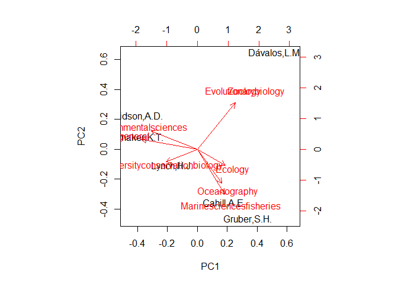

# Faculty Niche
Ben Weinstein  
Saturday, November 01, 2014  

#Approach

  * Query Articles
    * Format Data
  * Define Authors by ID
  * Characterize journals
  * Define Author Niche
  * Calculate Niche Overlap
    * Within institution
    * For a given article
  * Question 1: Model Fitting: Are articles by specialist or generalist more cited?
  * Question 2: Level of academic specialization within departments
  
#Hypotheses

  * Articles by highly similiar authors with high niche overlap will be higher cited due intense domain-specific knowledge
  * Articles by authors with low niche overlap will be higher cited due to novel insights

#Journal Classifications


```r
#read in data
j_class<-read.csv("Class.csv",row.names=1)

#collapse into a string, formatting spaces with + and place a boolean OR in between each
serial<-j_class$Publication
s<-gsub(x=serial,replacement="\\+",pattern=" ")
serials<-paste(s,collapse="OR")
```

  
#Basic Query Search


```r
library(XML)
library(plyr)
library(dplyr)
```

```
## 
## Attaching package: 'dplyr'
## 
## The following objects are masked from 'package:plyr':
## 
##     arrange, count, desc, failwith, id, mutate, rename, summarise,
##     summarize
## 
## The following object is masked from 'package:stats':
## 
##     filter
## 
## The following objects are masked from 'package:base':
## 
##     intersect, setdiff, setequal, union
```

```r
library(ggplot2)
library(reshape2)
library(httr)
library(stringr)
library(chron)
library(vegan)
```

```
## Loading required package: permute
## Loading required package: lattice
## This is vegan 2.2-0
```

##Test query

Here is the base url; http://api.elsevier.com/content/search/scopus
*query=the main query with descriptors.

The descriptors are ennumerated here:
http://api.elsevier.com/content/search/fields/scopus

Get all articles by author Ben Weinstein

The boolean escapes are + and parenthesis need to be %28 and %29

```r
#format string
query<-"query=SUBJAREA(AGRI)+OR+SUBJAREA(ENVI)+AND+affil(Stony+Brook+University)+Ecology+Evolution"

#url encoding
#reform query to html encoded
queryF<-gsub(x=query,"\\(","%28")
queryF<-gsub(x=queryF,"\\)","%29")
queryF<-gsub(x=queryF,"\\+","%20")

queryF
```

```
## [1] "query=SUBJAREA%28AGRI%29%20OR%20SUBJAREA%28ENVI%29%20AND%20affil%28Stony%20Brook%20University%29%20Ecology%20Evolution"
```

###Query Parameters
*httpAccept=application/xml returns an xml result
Add my api key

Institution token - cannot be viewed in browser, save in file outside of git.

```r
inst.token<-readLines("C:/Users/Ben/Dropbox/FacultyNetwork/InstToken.txt")
apiKey<-readLines("C:/Users/Ben/Dropbox/FacultyNetwork/apikey.txt")
```


```r
#format string
str<-"https://api.elsevier.com/content/search/scopus?&httpAccept=application/xml&count=100&view=complete"

#fields
f<-"field=affiliation,prism:publicationName,dc:title,dc:creator,citedby-count,prism:coverDate,author,dc:identifier"
```

##Build queries

  * Arguments
  * Desired fields
  * Query terms
  
It's easiest to bind these together seperately, to create one long call

We need to know author, affiliation, publication name, and citation count


```r
toget<-paste(str,queryF,sep="&")

#add in api and institutional key
toget<-paste(toget,"&apiKey=",apiKey,sep="")
toget<-paste(toget,"&insttoken=",inst.token,sep="")

#add fields
toget<-paste(toget,f,sep="&")
```

Request query

```r
#call
response <- GET(toget)
```

Parse


```r
xml <- xmlInternalTreeParse(response)
xmltop = xmlRoot(xml) #gives content of root
class(xmltop)#"XMLInternalElementNode" "XMLInternalNode" "XMLAbstractNode"
```

```
## [1] "XMLInternalElementNode" "XMLInternalNode"       
## [3] "XMLAbstractNode"
```

```r
xmlName(xmltop) #give name of node
```

```
## [1] "search-results"
```

```r
xmlSize(xmltop) #how many children in node
```

```
## [1] 108
```

```r
xmlName(xmltop[[1]]) #name of root's children
```

```
## [1] "totalResults"
```

```r
#set namespaces
#define name spaces
nsDefs<-xmlNamespaceDefinitions(xmltop)
ns <- structure(sapply(nsDefs, function(x) x$uri), names = names(nsDefs))

names(ns)[1] <- "xmlns"
```

#Format Results

##Get journal


```r
#get
journal<-xpathSApply(xmltop,"//prism:publicationName",xmlValue,namespaces=ns)
```

##Get first author

List with a position for each article


```r
authors<-xpathSApply(xmltop,"//dc:creator",xmlValue,namespaces=ns)
```

##All authors
The requestor is not authorized to access this resource yet?

```r
#how many articles are there?
lresponse<-length(getNodeSet(xmltop,"//xmlns:entry",namespaces=ns,xmlValue))

#loop through each article and get author list
allauthors<-list()
for (x in 1:lresponse){
  #make an xpath statement
  xpath<-paste("//xmlns:entry[",x,"]//xmlns:author/xmlns:authname",sep="")
  allauthors[[x]]<-as.list(xpathSApply(xmltop,xpath,xmlValue,namespaces=ns))
}

names(allauthors)<-xpathSApply(xmltop,"//xmlns:entry//dc:identifier",xmlValue,namespaces=ns)
```

##Affiliation


```r
#first author
aff<-xpathSApply(xmltop,"//xmlns:entry//xmlns:affilname[1]",xmlValue,namespaces=ns)
```


```r
#All affiliations
allaff<-list()
for (x in 1:lresponse){
  #make an xpath statement
  xpath<-paste("//xmlns:entry[",x,"]//xmlns:affiliation/xmlns:affilname",sep="")
  allaff[[x]]<-as.list(xpathSApply(xmltop,xpath,xmlValue,namespaces=ns))
}

#fill any null positions with NA
allaff[sapply(allaff,length)==0]<-NA

#Name by DOI
names(allaff)<-xpathSApply(xmltop,"//xmlns:entry//dc:identifier",xmlValue,namespaces=ns)
```

##Citation Count


```r
citation<-xpathSApply(xmltop,"//xmlns:entry//xmlns:citedby-count",xmlValue,namespaces=ns)
```

##Year


```r
Year<-years(xpathSApply(xmltop,"//xmlns:entry//prism:coverDate",xmlValue,namespaces=ns))
```


```r
DOI<-xpathSApply(xmltop,"//xmlns:entry//dc:identifier",xmlValue,namespaces=ns)
```


Bind article level statistics


```r
artdf<-data.frame(First_Author=authors,Journal=journal,Citations=citation,Year=Year,DOI)
```

Bind author level statistics


```r
#melt and combine
allauthors<-melt(allauthors)
colnames(allauthors)<-c("Author","Order","DOI")
allaff<-melt(allaff)
colnames(allaff)<-c("Affiliation","Order","DOI")
authdf<-merge(allauthors,allaff)
```

#Storing Results
  * Create a database to update results
  This only needs to be done once.

```r
#Create a database (once)
#my_db <- src_sqlite("Scopus", create = T)
copy_to(my_db, artdf, temporary = FALSE,name="Articles")
copy_to(my_db, authdf, temporary = FALSE,name="Authors")
```

##Update Results

#Academic departments
#If reading in from file


```r
depts<-read.csv("depts.csv")
```

#Match journal to classification

We'll need to work on classifiers, but this is a start.


```r
#article match to classifier
artmatch<-artdf[artdf$Journal %in% j_class$Publication,]

#merge into final table
dat<-droplevels(merge(authdf,artmatch))
```

##Filter Authors


```r
sort(table(dat$Author))
```

```
## 
##             Turner,A.H.        Sierra-Corona,R.        Fredrickson,E.L. 
##                       1                       1                       1 
##           Luna-Soria,H.            Dheilly,N.M.                Maure,F. 
##                       1                       1                       1 
##             Ravallec,M.             Galinier,R.                Doyon,J. 
##                       1                       1                       1 
##                Duval,D.            Casanovas,P.                Rowan,J. 
##                       1                       1                       1 
##              Faith,J.T.                Gebru,Y.            Fleagle,J.G. 
##                       1                       1                       1 
##        Abercrombie,D.L.            Markham,A.C.           Lonsdorf,E.V. 
##                       1                       1                       1 
##              Pusey,A.E.             Murray,C.M.           Carlisle,A.B. 
##                       1                       1                       1 
##            Goldman,K.J.             Litvin,S.Y.            Madigan,D.J. 
##                       1                       1                       1 
##              Jones,K.E.            Gillett,D.J.           Weisberg,S.B. 
##                       1                       1                       1 
##              Grayson,T.           Hamilton,A.T.             Hansen,V.D. 
##                       1                       1                       1 
##              Leppo,E.W.          Pelletier,M.C.                Borja,Á. 
##                       1                       1                       1 
##             Cadien,D.B.              Dauer,D.M.               Diaz,R.J. 
##                       1                       1                       1 
##              Dutch,M.E.             Hyland,J.L.              Kellogg,M. 
##                       1                       1                       1 
##             Larsen,P.F.           Levinton,J.S.             Llansó,R.J. 
##                       1                       1                       1 
##             Lovell,L.L.           Montagna,P.A.                Reddy,S. 
##                       1                       1                       1 
##              Sharief,S.               Yohe,L.R.            Witkowski,J. 
##                       1                       1                       1 
##           Di Fiore,A.D.             Chaves,P.B.            Cornejo,F.M. 
##                       1                       1                       1 
##            Schmitt,C.A.               Shanee,S.         Cortés-Ortiz,L. 
##                       1                       1                       1 
##             Fagundes,V.                 Roos,C.              Pacheco,V. 
##                       1                       1                       1 
##               Ashe,J.L.             Brooks,E.J.          O'Connell,M.T. 
##                       1                       1                       1 
##             Skomal,G.B.               Supp,S.R.             Pacifici,M. 
##                       1                       1                       1 
##              Foden,W.B.             Visconti,P.           Watson,J.E.M. 
##                       1                       1                       1 
##         Butchart,S.H.M.             Kovacs,K.M.          Scheffers,B.R. 
##                       1                       1                       1 
##               Hole,D.G.             Martin,T.G.            Corlett,R.T. 
##                       1                       1                       1 
##              Huntley,B.           Bickford,D.P.               Carr,J.A. 
##                       1                       1                       1 
##           Hoffmann,A.A.            Midgley,G.F.         Pearce-Kelly,P. 
##                       1                       1                       1 
##           Williams,S.E.             Willis,S.G.                Young,B. 
##                       1                       1                       1 
##              Perez,K.O.              Munch,S.B.            Bublitz,D.C. 
##                       1                       1                       1 
##     Rasambainarivo,F.T.            Bodager,J.R.                Zohdy,S. 
##                       1                       1                       1 
##             Almécija,S. Hattenrath-Lehmann,T.K.              Smith,J.L. 
##                       1                       1                       1 
##            Wallace,R.B.                 Koch,F.            Trathan,P.N. 
##                       1                       1                       1 
##    García Borboroglu,P.            Boersma,D.D.               Bost,C.A. 
##                       1                       1                       1 
##         Crawford,R.J.M.            Crossin,G.T.           Cuthbert,R.J. 
##                       1                       1                       1 
##                 Dann,P.              Davis,L.S.         De La Puente,S. 
##                       1                       1                       1 
##            Ellenberg,U.              Mattern,T.             Gignac,P.M. 
##                       1                       1                       1 
##           Erickson,G.M.            Kuczynski,K.                Koury,S. 
##                       1                       1                       1 
##          Schwaller,M.R.             Gerber,B.D.              Tecot,S.R. 
##                       1                       1                       1 
##             Blanco,M.B.         Winchester,J.M.             Jernvall,J. 
##                       1                       1                       1 
##             DeScioli,P.           Massenkoff,M.                 Shaw,A. 
##                       1                       1                       1 
##         Petersen,M.B.A.            Kurzban,R.O.              Gibbs,J.P. 
##                       1                       1                       1 
##             Hunter,E.A.              Tapia,W.H.              Cayot,L.J. 
##                       1                       1                       1 
##             Cooper,L.N.           Clementz,M.T.              Madar,S.I. 
##                       1                       1                       1 
##               Bajpai,S.            Hussain,S.T.        Thewissen,J.G.M. 
##                       1                       1                       1 
##                Engel,A.              Novoa,C.C.                Wurst,M. 
##                       1                       1                       1 
##               Endres,S.                Salmi,R.        Hammerschmidt,K. 
##                       1                       1                       1 
##       Doran-Sheehy,D.M.              Baumann,H.             Bliska,J.B. 
##                       1                       1                       1 
##                Bolet,A.              Delfino,M.              Fortuny,J. 
##                       1                       1                       1 
##               Alba,D.M.              Allam,B.A.          Karatayev,A.Y. 
##                       1                       1                       1 
##          Burlakova,L.E.             Murray,C.S.         Martínez,C.A.M. 
##                       1                       1                       1 
##               Rest,J.S.          McCartney,J.A.            Stevens,N.J. 
##                       1                       1                       1 
##           O'connor,P.M.                 Pina,M.            O'Neill,M.C. 
##                       1                       1                       1 
##     Aiello-Lammens,M.E.        Fisher-Reid,M.C.                  Hua,X. 
##                       1                       1                       1 
##              Wiens,J.J.             Burson,A.M.            Scheidt,D.M. 
##                       1                       1                       1 
##            Gunnell,G.F.            Simmons,N.B.              Rhainds,M. 
##                       1                       1                       1 
##          Calabrese,J.M.             Cantrell,S.               Cosner,C. 
##                       1                       1                       1 
##             Murray,K.A. Verde Arregoitia,L.D.A.           Di Marco,M.D. 
##                       1                       1                       1 
##                 Chan,H.           Karraker,N.E.                   Xu,L. 
##                       1                       1                       1 
##                Zhang,F.                Zhang,K.              Evans,S.E. 
##                       1                       1                       1 
##            Groenke,J.R.            Jones,M.E.H.                 Chen,X. 
##                       1                       1                       1 
##                Kruta,I.            Landman,N.H.            Cochran,J.K. 
##                       1                       1                       1 
##         Fitzgerald,S.P.          Koricheva,J.K.            Gurevitch,J. 
##                       1                       1                       1 
##            Thorson,J.T.               Baab,K.L.            Perry,J.M.G. 
##                       1                       1                       1 
##               Machac,A.        Chejanovski,Z.A.             Duncan,R.P. 
##                       1                       1                       1 
##               Husník,F.         Van Leuven,J.T.            Gilbert,D.G. 
##                       1                       1                       1 
##               Soligo,C.           Veeramah,K.R.         Gutenkunst,R.N. 
##                       1                       1                       1 
##              Lyosn,P.J.               Monzõn,J.               Kays,R.W. 
##                       1                       1                       1 
##          Dykhuizen,D.E.           Ernest,S.K.M.            Russell,A.L. 
##                       1                       1                       1 
##            Brown,J.H.U.             Burger,J.R.           Burnside,W.R. 
##                       1                       1                       1 
##                Chang,M.            Fristoe,T.S.             Dumont,E.R. 
##                       1                       1                       1 
##            Samadevam,K.              Warsi,O.M.          Kuczynski,C.A. 
##                       1                       1                       1 
##            Velazco,P.M.              Gedamke,T.             Newman,J.M. 
##                       1                       1                       1 
##              White,E.R.            Keeling,P.J.                Burki,F. 
##                       1                       1                       1 
##             Wilcox,H.M.              Allen,E.E.     Amaral-Zettler,L.A. 
##                       1                       1                       1 
##           Armbrust,V.V.          Archibald,J.M.             Bharti,A.K. 
##                       1                       1                       1 
##               Bell,C.J.             Beszteri,B.              Bidle,K.D. 
##                       1                       1                       1 
##            Cameron,C.T.           Campbell,L.D.              Caron,D.A. 
##                       1                       1                       1 
##        Cattolico,R.A.A.              Coyne,K.J.               Davy,S.K. 
##                       1                       1                       1 
##            Deschamps,P.            Dyhrman,S.T.            Edvardsen,B. 
##                       1                       1                       1 
##              Gates,R.D.          Greenwood,S.J.              Guida,S.M. 
##                       1                       1                       1 
##             Jacobi,J.L.           Jakobsen,K.S.              James,E.R. 
##                       1                       1                       1 
##            Jenkins,B.D.                 John,U.            Johnson,M.D. 
##                       1                       1                       1 
##               Juhl,A.R.                 Kamp,A.               Katz,L.A. 
##                       1                       1                       1 
##              Kiene,R.P.          Kudryavtsev,A.            Leander,B.S. 
##                       1                       1                       1 
##                  Lin,S.              Lovejoy,C.               Lynn,D.H. 
##                       1                       1                       1 
##            Marchetti,A.            McManus,G.B.            Nedelcu,A.M. 
##                       1                       1                       1 
##         Menden-Deuer,S.               Miceli,C.                 Mock,T. 
##                       1                       1                       1 
##            Montresor,M.            Moran,M.A.N.             Murray,S.A. 
##                       1                       1                       1 
##           Nadathur,G.S.                Nagai,S.               Ngam,P.B. 
##                       1                       1                       1 
##            Palenik,B.P.        Pawlowski,J.A.N.                 Vale,A. 
##                       1                       1                       1 
##      Pérez-Obregón,R.A.        Faife-Cabrera,M.            Álvarez,J.C. 
##                       1                       1                       1 
##                Rojas,D.          Bonebrake,T.C.            Syphard,A.D. 
##                       1                       1                       1 
##             Franklin,J.           Anderson,K.E.              Mizerek,T. 
##                       1                       1                       1 
##         Dibattista,J.D.            Babcock,E.A.             Hendry,A.P. 
##                       1                       1                       1 
##            Pikitch,E.K.             Ashley,M.V.             Fields,A.T. 
##                       1                       1                       2 
##           Feldheim,K.A.          Chapman,D.D.F.             Smaers,J.B. 
##                       2                       2                       2 
##              Goswami,A.             Reyier,E.A.         Akçakaya,R.R.E. 
##                       2                       2                       2 
##            Pearson,R.G.            Stanton,J.C.             Wright,P.C. 
##                       2                       2                       2 
##             Gobler,C.J.                Cogni,R.           Seiffert,E.R. 
##                       2                       2                       2 
##                Viard,F.            Collier,J.L.             Franks,B.R. 
##                       2                       2                       2 
##             Kessel,S.T.           Davidson,A.D.             Gruber,S.H. 
##                       2                       3                       3 
##            Dávalos,L.M.             Cahill,A.E.          Shoemaker,K.T. 
##                       3                       4                       4 
##              Lynch,H.J. 
##                       5
```

```r
#Cutoff for articles, atleast 5 in my little example
keep<-names(which(table(dat$Author)>2))

head(dat)
```

```
##                     DOI Order         Author
## 1 SCOPUS_ID:84891557648     1      Monzõn,J.
## 2 SCOPUS_ID:84891557648     2      Kays,R.W.
## 3 SCOPUS_ID:84891557648     3 Dykhuizen,D.E.
## 4 SCOPUS_ID:84891559527     6    Hendry,A.P.
## 5 SCOPUS_ID:84891559527     7   Pikitch,E.K.
## 6 SCOPUS_ID:84891559527     5    Kessel,S.T.
##                                           Affiliation   First_Author
## 1 Stony Brook University State University of New York     Monzõn, J.
## 2           North Carolina Museum of Natural Sciences     Monzõn, J.
## 3                     North Carolina State University     Monzõn, J.
## 4                                   McGill University Feldheim, K.A.
## 5 Stony Brook University State University of New York Feldheim, K.A.
## 6    Great Lakes Institute for Environmental Research Feldheim, K.A.
##             Journal Citations Year
## 1 Molecular Ecology         5 2014
## 2 Molecular Ecology         5 2014
## 3 Molecular Ecology         5 2014
## 4 Molecular Ecology         7 2014
## 5 Molecular Ecology         7 2014
## 6 Molecular Ecology         7 2014
```

```r
tocompare<-droplevels(dat[dat$Author %in% keep,])
```

#Build Dissimilarity matrix

Merge table classification

```r
#append journal classifier
tocompare<-droplevels(merge(tocompare,j_class,by.x="Journal",by.y="Publication"))
siteXspp<-as.data.frame.array(table(tocompare$Author,tocompare$Class))
#remove empty colums
```

##Biplot

```r
biplot(prcomp(siteXspp,scale=T))
```

 

##Niche Overlap
Horn's distance between authors


```r
dis<-vegdist(siteXspp,"horn")
dis
```

```
##                Cahill,A.E. Davidson,A.D. Lynch,H.J. Gruber,S.H.
## Davidson,A.D.    1.0000000                                     
## Lynch,H.J.       0.6000000     0.8543689                       
## Gruber,S.H.      0.3000000     1.0000000  0.7777778            
## Shoemaker,K.T.   0.7546012     0.4626866  0.3197279   1.0000000
## Dávalos,L.M.     0.8275862     1.0000000  0.6153846   0.8076923
##                Shoemaker,K.T.
## Davidson,A.D.                
## Lynch,H.J.                   
## Gruber,S.H.                  
## Shoemaker,K.T.               
## Dávalos,L.M.        1.0000000
```


